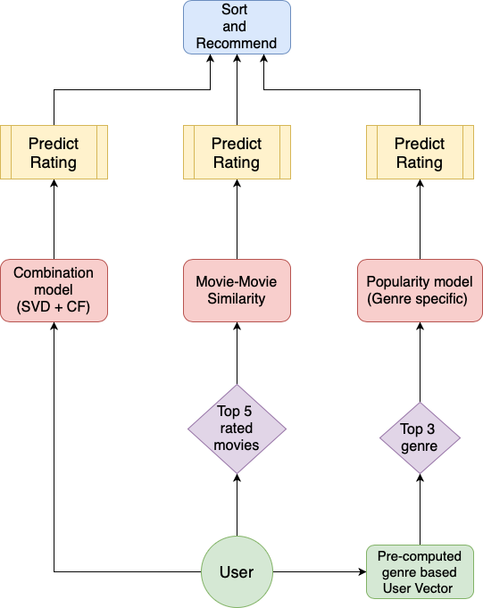

# Movie-Recommendation-System

**Dataset used:** 
1. [MovieLens](https://grouplens.org/datasets/movielens/)
2. [The Movie Database: tmdb](https://www.kaggle.com/tmdb/tmdb-movie-metadata)

**Aim:** Build a movie recommendation system by integrating the aspects of personalization of user with the overall features of movie such as genre, popularity etc.  

**Models:**
* Popularity model
* Content based model: genre, year of release, ratings of movies
* Collaborative filtering: User vs item, KNN similarity measures
* Latent Factor based SVD
* Combined linear model using surprise library (CF + SVD)
* Hybrid model (content based + popularity based + item-item CF + svd)

**Results:**

All the models are implemented in Python using pandas, sklearn and [surprise](http://surpriselib.com/) library. The hyperparameter tuning, testing accuracy (RMSE and MAE) and evaluation of recommendations (precision, recall, f-measure and ndcg) for each model are thoroughly performed. The detailed analysis of the models is presented in the report. 
